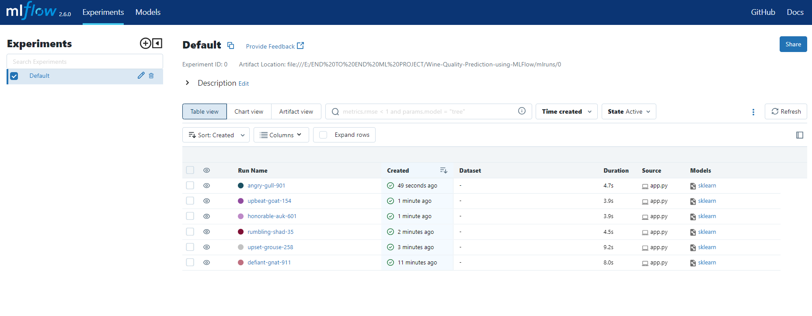
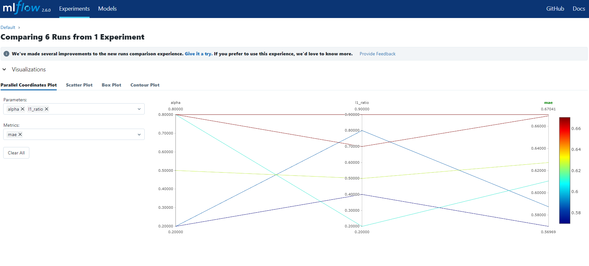
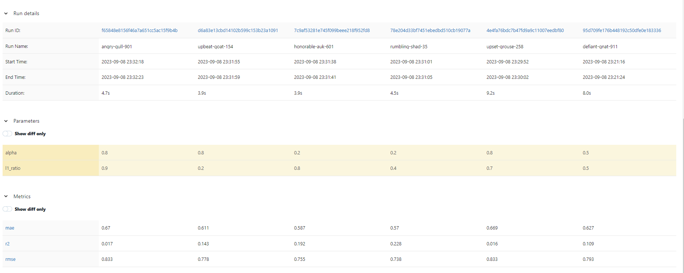
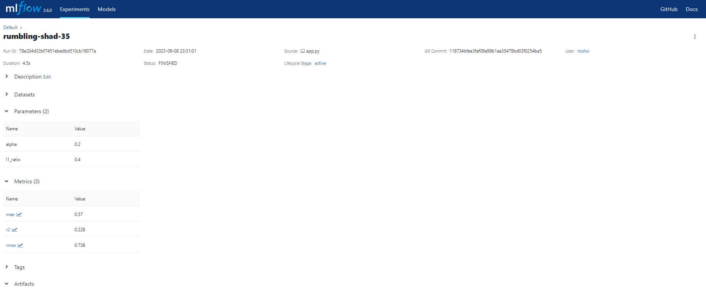
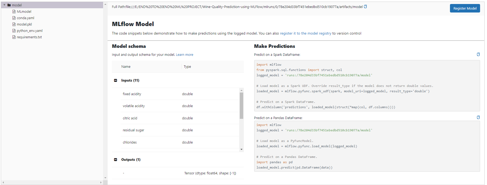

# Wine Quality Prediction using ElasticNet Regression

This project demonstrates how to build and deploy a machine learning model for predicting wine quality using the ElasticNet regression algorithm. The dataset used in this example is sourced from the UCI Machine Learning Repository and contains physicochemical properties of wines.

## Dataset Information

- **Title**: Wine Quality
- **Publication**: [Decision Support Systems, Elsevier, 2009](https://www.sciencedirect.com/science/article/pii/S0167923609001377)
- **Dataset URL**: [Wine Quality Dataset](http://archive.ics.uci.edu/ml/datasets/Wine+Quality)

## Project Structure

- `wine_quality_prediction.py`: Python script containing the machine learning code.
- `requirements.txt`: A list of Python packages required to run the project.
- `README.md`: This file, providing an overview of the project.
- `LICENSE`: The license information for the project.
- `.gitignore`: Specifies files and directories to be ignored by Git.
- `mlruns/`: MLflow tracking directory for storing experiment runs.
- `data/`: Directory where the dataset is downloaded and stored.

## Getting Started

### Prerequisites

Before running the project, make sure you have the following prerequisites installed:

- Python 3.x
- Required Python packages (install via `pip install -r requirements.txt`).

### Running the Project

1. Clone this repository to your local machine:

   ```bash
   git clone https://github.com/your-username/wine-quality-prediction.git
   cd wine-quality-prediction
   ```

2. Install the required packages:

   ```bash
   pip install -r requirements.txt
   ```

3. Run the machine learning script to train an ElasticNet regression model and log the results using MLflow:

   ```bash
   python wine_quality_prediction.py <alpha> <l1_ratio>
   ```

   Replace `<alpha>` and `<l1_ratio>` with your desired values for model hyperparameters. If not provided, default values are used.

4. MLflow will log the model and metrics, and you can view the results in the MLflow UI.

```bash
   mlflow ui
```

models view

chart comparison

model information

model parameters and metrics

model prediction analogy


## Model Deployment

The trained ElasticNet model can be deployed using various platforms, such as MLflow's built-in model serving capabilities, cloud-based solutions, or other deployment options. For specific deployment instructions, refer to the documentation of your chosen deployment platform.

## License

This project is licensed under the MIT License - see the [LICENSE](LICENSE) file for details.

## Acknowledgments

- UCI Machine Learning Repository for providing the Wine Quality dataset.
- MLflow for model tracking and management.
- The authors of the Wine Quality dataset for their valuable contributions to the field of data mining.

Feel free to contribute to this project by opening issues or submitting pull requests. Happy modeling!
```

Make sure to replace `"https://github.com/your-username/wine-quality-prediction.git"` with the actual URL of your GitHub repository. You can also customize the README further to include specific details about your project and any additional information you find relevant.